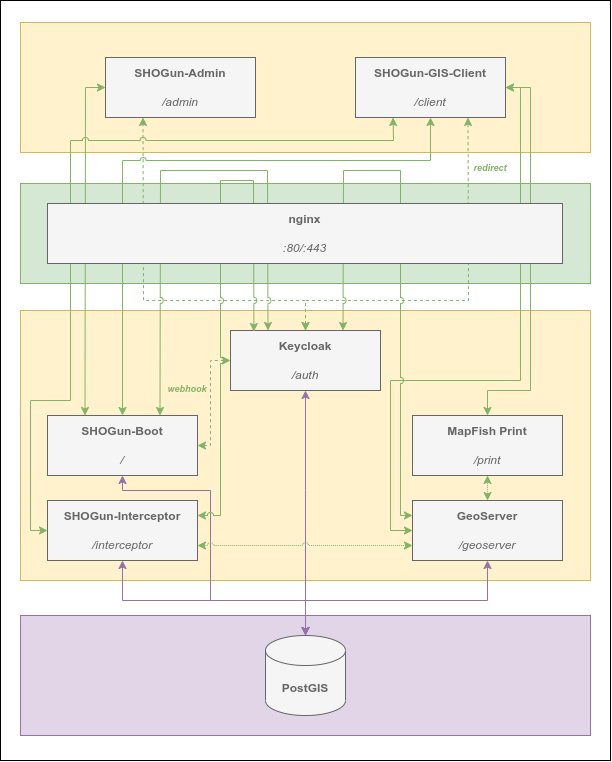

# General overview
***
The basic technology behind the **SHOGun**-web-application is made up of various components as shown in the following image:

For the usage of the SHOGun-Web-GIS in particular two components are important:
- [Admin-Client](../2_admin-client/index.md)
- [GIS-Client](../3_gis-client/index.md)

The [Admin-Client](../2_admin-client/index.md) component is basically an UI for handling SHOGun entities like users, applications, and layers. Whereas the [GIS-Client](../3_gis-client/index.md) represents a created instance from the admin client.
