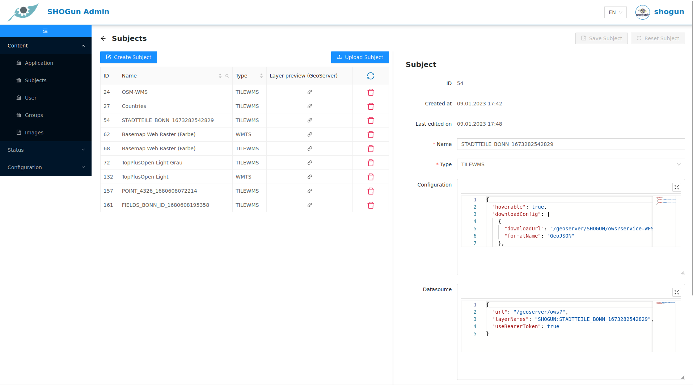

# Subjects
***
Under the menu-item *Subjects* external WMS can be persisted for the applications and custom raster or vector data can be imported. In addition, various settings can be made for each layer.



Existing services can be modified by clicking in the respective row within the subject-grid. To add a new WMS service click the  button. 

Raster or Vector data can be imported via the  button.

Once a subject got modified, it can be saved via the  button.

Unsaved changes can be reset by the  button.

When creating/editing a subject, the field *Datasource* must be filled in addition to the name for the subject as well as the type (can be selected from the suggestion list).

## Configuration

This field stores the configuration for the respective subject in JSON format and could look like as follows:

```
{
  "hoverable": false,
  "opacity": 0.5,
  "downloadConfig": [
    {
      "downloadUrl": "https://my-url.org/my/path/to/the/subject.tiff",
      "formatName": "my-subject"
    }
  ]
}
```

This is a full list of parameters that can be edited:

|Key|Description|Example|Required|
|---|---|---|---|
|`crossOrigin`|Set to 'anonymous' if you encounter any problems while querying a layer in the Web-GIS application. Usually you don't want to overwrite this.|'anonymous'|false|
|`downloadConfig`|List of download configurations. If set, a new menu-item within the layertree appears to download the layer|https://example.com/geoserver/SHOGUN/ows?service=WFS&version=1.0.0&request=GetFeature&outputFormat=application%2Fjson|false|
|`downloadConfig -> downloadUrl`|URL which allows to download the layer data|see above|true|
|`downloadConfig -> formatName`|The displayed format name for the given downloadUrl. If not set it will be set to 'XML'|'GeoJSON'|false|
|`hoverable`|Determines whether map features may be queried using the Query map features tool|true|false|
|`maxResolution`|The maximum resolution of the layer (to which resolution/zoom level the layer should be visible)|100000|false|
|`minResolution`|The minimum resolution of the layer (at what resolution/zoom level the layer should become visible)|10000|false|
|`opacity`|Sets the initial opacity for the layer with a range from 0-1|0.5|false|
|`propertyConfig`|Is currently not in use||false|
|`searchable`|Is currently not in use||false|
|`searchConfig`|Is currently not in use||false|

## Datasource

This field defines the source of the subject in JSON format. Depending on the type of the topic, the datastructure differs:


```
{
  "url": "https://ows.terrestris.de/osm-gray/service?",
  "layerNames": "OSM-WMS",
  "attribution": "&copy; <a href=\"https://www.openstreetmap.org/copyright\">OpenStreetMap contributors</a>",
  "useBearerToken": false
}
```

This is a full list of parameters that can be edited:

|Key|Description|Example|Required|
|---|---|---|---|
|`url`|The base URL of the layer|https://ows.terrestris.de/osm-gray/service?|true|
|`layerNames`|A comma separated list of layers to request|'OSM-WMS'|true|
|`attribution`|The copyright attribution to be shown for this layer. It will be rendered in the bottom corner of the map.|`&copy; <a href=\"https://www.openstreetmap.org/copyright\">OpenStreetMap contributors</a>`|false|
|`useBearerToken`|Whether to send the (internal) Keycloak Bearer Token alongside the map requests or not. Has to be set to 'true' when a layer is requested from the internal GeoServer|true|false|
|`legendUrl`|An URL to a custom legend image that will be displayed within the layertree|https://ows.terrestris.de/ows/my-legend.png|false|
|`matrixSet`|Tile Matrix Set identifier, which determines the CRS into which the layer will be exposed. Must be one of the listed tile matrix for the layer. See details here https://gdal.org/drivers/raster/wmts.html|'WEBMERCATOR'|false|
|`requestParams`|Request parameters to be passed to the map server when querying a layer e.g. via GetMap. This can be useful if you want to pass server specific parameters|'{\"transparent\": true}'|false|
|`resolutions`|The list of resolutions the layer should be requested on|'[2445.9849047851562, 1222.9924523925781, 611.4962261962891]'|false|
|`tileOrigin`|Origin of the tile grid. Usually you don't want to set a custom value. See here for details ToDo.||false|
|`tileSize`|Sets the tile size. Default is 256 |512|false|

<!-- You can find an illustrative example of how to configure a layer in the following video:
<ReactPlayer controls width="max" height="max" url="/shogun-docs/videos/admin-client-subject.mp4" /> -->
