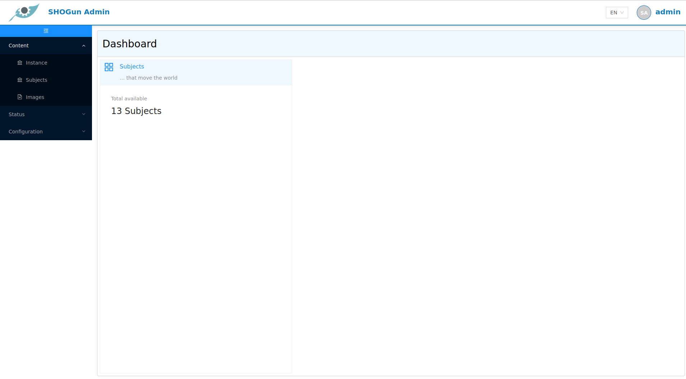

# Admin-Client
***
The [Admin-Client](https://shogun2022.intranet.terrestris.de/admin) is used to create individual **Web-GIS applications**. You can define which layers should initially be available for an application, which users should have access to the application and which tools are available. In addition, further styling settings can be made and the resolution as well as the projection can be set.

Only users with the **Admin** role have access to the [Admin-Client](https://shogun2022.intranet.terrestris.de/admin) and can create or modify Web-GIS applications. 

After successful login, the administrator sees the dashboard in the right area, which lists the existing entities (Applications and Subjects) in short form. By clicking on an entry in the respective lists, a desired entry can be selected directly.
