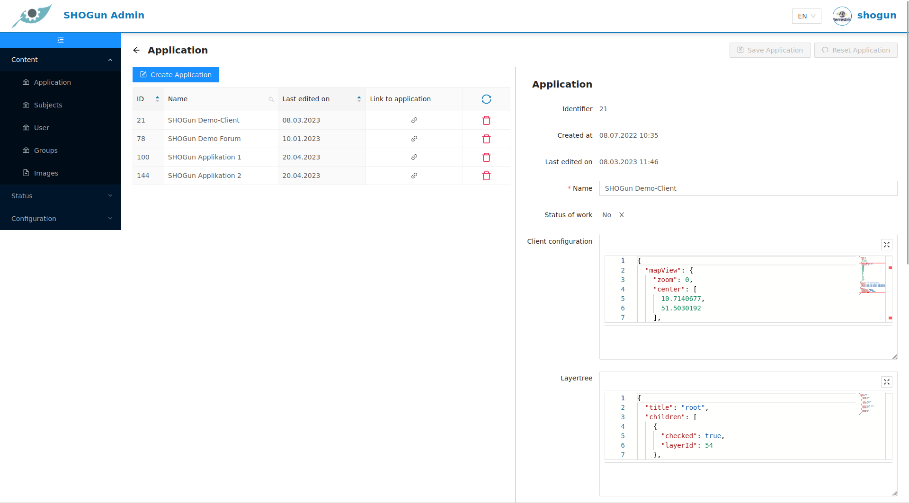
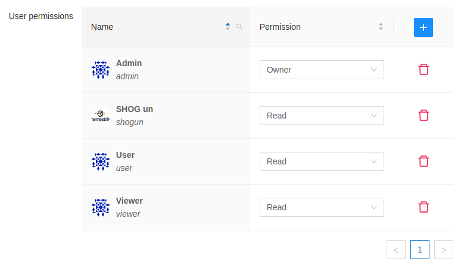
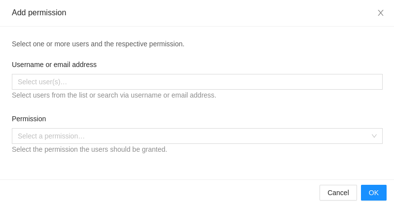

# Application
***
Under the heading **Application** you will find the possibility to create new Web-GIS applications or to edit existing ones. By selecting an application, the edit menu opens. 



As soon as an application entry is filled with all required information, it can be saved via the button .

The  button can be used to reset the application input form. All changes since the last saving are discarded. 

When creating/editing an application, the fields *Client configuration* and *Layer tree* must be filled in addition to the name for the application.

## Client configuration

This field stores the configuration of the application in JSON format. Every application can be modified by editing the JSON format parameters, for example the initial zoom level, the title, or the color-scheme: 

<details>
<summary>Client configuration as <b>JSON</b></summary>
<div>
  <pre>
  {
  JSON.stringify(
  {
   'mapView': {
    'zoom': 3,
    'center': [
      11.4717964,
      48.155004
    ],
    'extent': null,
    'projection': 'EPSG:3857',
    'resolutions': [
      8920,
      4480,
      2240,
      1120,
      560,
      350,
      280,
      140,
      70,
      28,
      14,
      7,
      2.8,
      1.4,
      0.7,
      0.28,
      0.07
    ]
  },
  'description': 'This is the Web GIS 1',
  'theme': {
    'primaryColor': '#555555',
    'secondaryColor': '#73b3fb',
    'complementaryColor': '#ffffff',
    'logoPath': 'null'
  }
  }, null, '  ')
  }
  </pre>
</div>
</details>

This is a full list of parameters that can be edited:

<!-- generated using https://www.tablesgenerator.com/markdown_tables -->

| Key | Description | Example | Required |
|---|---|---|---|
| `defaultLanguage` | The default language of the application [(ISO 639-1)](https://en.wikipedia.org/wiki/List_of_ISO_639-1_codes). | 'de' | false |
| `description` | Description of the application to be displayed on the start page. | 'My Web-GIS' | false |
| `legal -> imprint` | URL pointing to imprint page/section. | '/imprint' | false |
| `legal -> imprint` | URL pointing to contact details. | '/imprint' | false |
| `legal -> privacy` | URL pointing to data privacy. | '/privacy' | false |
| `mapView -> zoom` | The initial zoom level of the map. | 7 | false |
| `mapView -> center` | The initial center of the map (in WGS84). | 'center': [7,51] | true |
| `mapView -> extent` | The maximum extent of the map (in WGS84). | `[2.5683045738288137, 45.429089001638076, 19.382621082401887, 57.283993958205926]` | false |
| `mapView -> projection` | Coordinate reference system of the map (EPSG-Code). | 'EPSG:3857' | false |
| `mapView → crsDefinitions` | The list of CRS definitions in proj4 format that should be registered in the application additionally. | { <br/>'crsCode': 'EPSG:25832',<br/>'definition': '+proj=utm +zone=32 +ellps=GRS80 +towgs84=0,0,0,0,0,0,0 +units=m +no_defs +type=crs'<br/>} | false |
| `mapView -> resolutions` | The list of resolutions of the map. | `[2445.9849047851562, 1222.9924523925781, 611.4962261962891]` | false |
| `theme -> primaryColor` | Defines the background color of the header and footer element. | '#444444' | false |
| `theme -> secondaryColor` | Defines the hovering color of text elements and buttons. | '#ffc0cb' | false |
| `theme -> complementaryColor` | Defines the font color of text elements within header and footer component. | '#000000' | false |
| `theme -> logoPath` | URL of the logo which is displayed in the header component. | 'https://my-logo.de/img/my-logo.png' | false |

<!-- You can find an illustrative example of how to change the zoom level, the center and the primary color in the following video:
<ReactPlayer controls width='max' height='max' url='/shogun-docs/videos/admin-client-configuration.mp4' /> -->

## Layer tree

This field stores the configuration for the application's layer tree in JSON format:

<details>
<summary>Layer tree configuration as <b>JSON</b></summary>
<div>
  <pre>
  {
  JSON.stringify(
  {
  'title': 'root',
  'children': [
    {
      'title': 'Copernicus Services',
      'checked': false,
      'children': [
        {
          'title': 'Land - VHR Mosaic',
          'checked': false,
          'children': [
            {
              'title': 'VHR 2018',
              'checked': false,
              'layerId': 23
            },
            {
              'title': 'VHR 2012',
              'checked': false,
              'layerId': 22
            }
          ]
        },
        {
          'title': 'Surfaceobservation - ESA WorldCover',
          'checked': false,
          'children': [
            {
              'title': 'Worldcover 2020',
              'checked': false,
              'layerId': 26
            }
          ]
        }
      ]
    },
    {
      'title': 'Community Contributions',
      'checked': true,
      'children': [
        {
          'title': 'Incora',
          'checked': true,
          'children': [
            {
              'title': 'Land Cover 2016',
              'checked': false,
              'layerId': 19
            },
            {
              'title': 'Land Cover 2019',
              'checked': false,
              'layerId': 20
            },
            {
              'title': 'Land Cover 2020',
              'checked': true,
              'layerId': 21
            }
          ]
        },
        {
          'title': 'Building Height Map (DE)',
          'checked': false,
          'layerId': 27
        },
        {
          'title': 'Land Cover Fraction Map (DE)',
          'checked': false,
          'layerId': 25
        }
      ]
    },
    {
      'title': 'Backgroundlayer',
      'checked': true,
      'children': [
        {
          'title': 'GEBCO',
          'checked': false,
          'layerId': 28
        },
        {
          'title': 'OSM-WMS',
          'checked': false,
          'layerId': 24
        },
        {
          'title': 'OSM-WMS (gray)',
          'checked': true,
          'layerId': 16
        }
      ]
    }
  ]
  }, null, '  ')
  }
  </pre>
</div>
</details>

The layer tree consists of two different elements `Layer` and `Layer group` which are defined in the JSON document. A `Layer` has the following structure:
```
'title': 'My Layer',
'checked': false,
'layerId': 42
```
One or more layers can be part of a `Layer group`. In this case they need to be added to the `children`-array as follow:
```
'title': 'My Layer group',
'checked': true,
'children': [
  {
    'title': 'Layer 1',
    'checked': true,
    'layerId': 12
  },
  {
    'title': 'Layer 2',
    'checked': true,
    'layerId': 24
  },
  {
    'title': 'Layer 3',
    'checked': true,
    'layerId': 16
  }
]
```
A `Layer group` can also be part of the `children`-array. In this case another hierarchy level will be added.

:::caution

The layerId has to be corresponding to the *[Subject](../admin-client/02-subject.md)s*-layerId!

:::

This is a full list of parameters that can be edited:

|Key|Description|Example|Required|
|---|---|---|---|
|`title`|Layer- or group name displayed within the layer tree. If not set, the layer name of the internal geoserver will be used|'My base layers'|false|
|`checked`|Defines whether a layer or all layers within a layer group shall be visible initially|true|false|
|`children`|Array of layer and layer group|[{'title': 'layer 1', 'checked': true, 'layerId':1 }]|false|
|`layerId`|LayerId corresponding to the LayerId of the [Subject](../admin-client/02-subject.md)|1|true|

<!-- You can find an illustrative example of how to change the name or initial visibility of a layer in the following video:
<ReactPlayer controls width='max' height='max' url='/shogun-docs/videos/admin-client-layertree.mp4' /> -->

## Layer configuration

Within the layer configuration window, predefined layer settings from the [Subjects](../admin-client/02-subject.md) section can be overwritten and customized for the particular application.

Each layer to be modified is an object within a array:
```
[
  {
    'layerId': 1,
    'clientConfig': {
      'opacity': 0.5
    }
  },
  {
    'layerId': 2,
    'clientConfig': {
      'hoverable': true
    }
  },
  {
    'layerId': 3,
    'sourceConfig': {
      'useBearerToken': true
    }
  }
]
```

This is a full list of parameters that can be edited:

|Key|Description|Example|Required|
|---|---|---|---|
|`layerId`|LayerId corresponding to the LayerId of the [Subject](../admin-client/02-subject.md)|1|true|
|`clientConfig -> hoverable`|see [Client Configuration](../admin-client/02-subject.md)|
|`clientConfig -> maxResolution`|see [Client Configuration](../admin-client/02-subject.md)|
|`clientConfig -> minResolution`|see [Client Configuration](../admin-client/02-subject.md)|
|`clientConfig -> opacity`|see [Client Configuration](../admin-client/02-subject.md)|
|`clientConfig -> propertyConfig`|see [Client Configuration](../admin-client/02-subject.md)|
|`clientConfig -> searchable`|see [Client Configuration](../admin-client/02-subject.md)|
|`clientConfig -> searchConfig`|see [Client Configuration](../admin-client/02-subject.md)|
|`sourceConfig -> requestParams`|see [Source Configuration](../admin-client/02-subject.md)|
|`sourceConfig -> resolutions`|see [Source Configuration](../admin-client/02-subject.md)|
|`sourceConfig -> tileOrigin`|see [Source Configuration](../admin-client/02-subject.md)|
|`sourceConfig -> tileSize`|see [Source Configuration](../admin-client/02-subject.md)|
|`sourceConfig -> url`|see [Source Configuration](../admin-client/02-subject.md)|
|`sourceConfig -> useBearerToken`|see [Source Configuration](../admin-client/02-subject.md)|

## Configure Tools

This field stores the configuration for the application tools in JSON format:

<details>
<summary>Tool configuration as <b>JSON</b></summary>
<div>
  <pre>
  {
  JSON.stringify(
  [
  {
    'name': 'measure_tools',
    'config': {
      'visible': true
    }
  },
  {
    'name': 'measure_tools_distance',
    'config': {
      'visible': true
    }
  },
  {
    'name': 'measure_tools_area',
    'config': {
      'visible': true
    }
  },
  {
    'name': 'draw_tools',
    'config': {
      'visible': true
    }
  },
  {
    'name': 'draw_tools_point',
    'config': {
      'visible': true
    }
  },
  {
    'name': 'draw_tools_line',
    'config': {
      'visible': true
    }
  },
  {
    'name': 'draw_tools_polygon',
    'config': {
      'visible': true
    }
  },
  {
    'name': 'draw_tools_circle',
    'config': {
      'visible': true
    }
  },
  {
    'name': 'draw_tools_rectangle',
    'config': {
      'visible': true
    }
  },
  {
    'name': 'draw_tools_annotation',
    'config': {
      'visible': true
    }
  },
  {
    'name': 'draw_tools_modify',
    'config': {
      'visible': true
    }
  },
  {
    'name': 'draw_tools_upload',
    'config': {
      'visible': true
    }
  },
  {
    'name': 'draw_tools_download',
    'config': {
      'visible': true
    }
  },
  {
    'name': 'draw_tools_delete',
    'config': {
      'visible': true
    }
  },
  {
    'name': 'feature_info',
    'config': {
      'visible': true
    }
  },
  {
    'name': 'print',
    'config': {
      'visible': true
    }
  },
  {
    'name': 'tree',
    'config': {
      'visible': true
    }
  },
  {
    'name': 'permalink',
    'config': {
      'visible': true
    }
  },
  {
    'name': 'language_selector',
    'config': {
      'visible': true
    }
  }
  ], null, '  ')
  }
  </pre>
</div>
</details>

Every available tool from the toolbox is recorded in this document. By changing the visibility of any tool to `true`, it is made available in the Web-GIS application. Please note that some tools also depend on other parameters (e.g. the queryability of a layer).

This is a full list of parameters that can be edited:

|Key|Description|
|---|---|
|`name`|Name of the tool. This parameter should not be edited|
|`config -> visible`|Sets the visibility of a certain tool within the Web-GIS application|

:::info

If you leave the configuration blank, all tools will be available by default. As soon as one tool is added to the configuration, all other tools will be unavailable until they are also explicitly added. 

:::

<!-- You can find an illustrative example of how to change the visibility of a tool in the following video:
<ReactPlayer controls width='max' height='max' url='/shogun-docs/videos/admin-client-configure-tools.mp4' /> -->

## User permissions

In the user permission field, users can be activated for the specific applications and assigned user permissions. 



Clicking on the  button opens a new window with two input fields:



After entering the e-mail address of a user, various permissions can be assigned to that specific user. The following permissions are available:

|Key|Description|
|---|---|
|`Read`|All authenticated users can access the Web-GIS application|
|`Update`|If set the user can modify the application configuration|
|`Update & Delete`|If set the user can modify and completely delete the application|
|`Owner`|If set the user can modify and delete the JSON-files configuring the Web-GIS and grant permissions to new users|

:::info

Every user listed within the permission grid has access to the Web-GIS application. Permissions other than `Read` only affect users who also have the `admin` role, since only these users can access the admin client and thus change the configurations.

:::

<!-- You can find an illustrative example of how to grant permissions to a user in the following video:
<ReactPlayer controls width='max' height='max' url='/shogun-docs/videos/admin-client-permissions.mp4' /> -->
