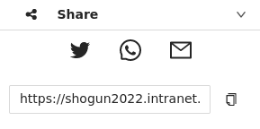

# Share a customized application

1. Open the Web-GIS client and customize the predefined application according to your needs, for example by loading a new WMS or deselect existing ones. In addition, you could zoom in on a specific map section to change the extent.

2. Use the [Share](../gis-client/toolbox/share) tool within your toolbox to share your customized application:

3. You can send the generated URL directly via twitter, whatsapp or email. Alternatively, you can copy the link to the clipboard.

:::info

The created URL has all the set information. Any authenticated user can access the modified application via the provided link. 

:::

4. Open the newly generated URL in a new Tab

:::info

As long as the layers are available under their URL or within the internal GeoServer, the link will be valid.

:::
