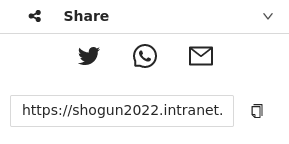

# General overview
***
The basic technology behind the **SHOGun**-web-application is made up of various components as shown in the following image:


For the usage of the SHOGun-Web-GIS in particular two components are important:
- [Admin-Client](../2_admin-client/index.md)
- [GIS-Client](../3_gis-client/index.md)

The [Admin-Client](../2_admin-client/index.md) component is basically an UI for handling SHOGun entities like users, applications, and layers. Whereas the [GIS-Client](../3_gis-client/index.md) represents a created instance from the admin client.

# Admin-Client
***
The [Admin-Client](https://shogun2022.intranet.terrestris.de/admin) is used to create individual **Web-GIS applications**. You can define which layers should initially be available for an application, which users should have access to the application and which tools are available. In addition, further styling settings can be made and the resolution as well as the projection can be set.


Only users with the **Admin** role have access to the [Admin-Client](https://shogun2022.intranet.terrestris.de/admin) and can create or modify Web-GIS applications. 

After successful login, the administrator sees the dashboard in the right area, which lists the existing entities (Applications and Subjects) in short form. By clicking on an entry in the respective lists, a desired entry can be selected directly.
# Application
***
Under the heading **Application** you will find the possibility to create new Web-GIS applications or to edit existing ones. By selecting an application, the edit menu opens. 


As soon as an application entry is filled with all required information, it can be saved via the button .

The  button can be used to reset the application input form. All changes since the last saving are discarded. 

When creating/editing an application, the fields *Client configuration* and *Layer tree* must be filled in addition to the name for the application.

## Client configuration

This field stores the configuration of the application in JSON format. Every application can be modified by editing the JSON format parameters, for example the initial zoom level, the title, or the color-scheme: 

<details>
<summary>Client configuration as <b>JSON</b></summary>
<div>
  <pre>
  {
  JSON.stringify(
  {
   'mapView': {
    'zoom': 3,
    'center': [
      11.4717964,
      48.155004
    ],
    'extent': null,
    'projection': 'EPSG:3857',
    'resolutions': [
      8920,
      4480,
      2240,
      1120,
      560,
      350,
      280,
      140,
      70,
      28,
      14,
      7,
      2.8,
      1.4,
      0.7,
      0.28,
      0.07
    ]
  },
  'description': 'This is the Web GIS 1',
  'theme': {
    'primaryColor': '#555555',
    'secondaryColor': '#73b3fb',
    'complementaryColor': '#ffffff',
    'logoPath': 'null'
  }
  }, null, '  ')
  }
  </pre>
</div>
</details>

This is a full list of parameters that can be edited:

<!-- generated using https://www.tablesgenerator.com/markdown_tables -->

| Key | Description | Example | Required |
|---|---|---|---|
| `defaultLanguage` | The default language of the application [(ISO 639-1)](https://en.wikipedia.org/wiki/List_of_ISO_639-1_codes). | 'de' | false |
| `description` | Description of the application to be displayed on the start page. | 'My Web-GIS' | false |
| `legal -> imprint` | URL pointing to imprint page/section. | '/imprint' | false |
| `legal -> imprint` | URL pointing to contact details. | '/imprint' | false |
| `legal -> privacy` | URL pointing to data privacy. | '/privacy' | false |
| `mapView -> zoom` | The initial zoom level of the map. | 7 | false |
| `mapView -> center` | The initial center of the map (in WGS84). | 'center': [7,51] | true |
| `mapView -> extent` | The maximum extent of the map (in WGS84). | `[2.5683045738288137, 45.429089001638076, 19.382621082401887, 57.283993958205926]` | false |
| `mapView -> projection` | Coordinate reference system of the map (EPSG-Code). | 'EPSG:3857' | false |
| `mapView → crsDefinitions` | The list of CRS definitions in proj4 format that should be registered in the application additionally. | { <br/>'crsCode': 'EPSG:25832',<br/>'definition': '+proj=utm +zone=32 +ellps=GRS80 +towgs84=0,0,0,0,0,0,0 +units=m +no_defs +type=crs'<br/>} | false |
| `mapView -> resolutions` | The list of resolutions of the map. | `[2445.9849047851562, 1222.9924523925781, 611.4962261962891]` | false |
| `theme -> primaryColor` | Defines the background color of the header and footer element. | '#444444' | false |
| `theme -> secondaryColor` | Defines the hovering color of text elements and buttons. | '#ffc0cb' | false |
| `theme -> complementaryColor` | Defines the font color of text elements within header and footer component. | '#000000' | false |
| `theme -> logoPath` | URL of the logo which is displayed in the header component. | 'https://my-logo.de/img/my-logo.png' | false |

<!-- You can find an illustrative example of how to change the zoom level, the center and the primary color in the following video:
<ReactPlayer controls width='max' height='max' url='/shogun-docs/videos/admin-client-configuration.mp4' /> -->

## Layer tree

This field stores the configuration for the application's layer tree in JSON format:

<details>
<summary>Layer tree configuration as <b>JSON</b></summary>
<div>
  <pre>
  {
  JSON.stringify(
  {
  'title': 'root',
  'children': [
    {
      'title': 'Copernicus Services',
      'checked': false,
      'children': [
        {
          'title': 'Land - VHR Mosaic',
          'checked': false,
          'children': [
            {
              'title': 'VHR 2018',
              'checked': false,
              'layerId': 23
            },
            {
              'title': 'VHR 2012',
              'checked': false,
              'layerId': 22
            }
          ]
        },
        {
          'title': 'Surfaceobservation - ESA WorldCover',
          'checked': false,
          'children': [
            {
              'title': 'Worldcover 2020',
              'checked': false,
              'layerId': 26
            }
          ]
        }
      ]
    },
    {
      'title': 'Community Contributions',
      'checked': true,
      'children': [
        {
          'title': 'Incora',
          'checked': true,
          'children': [
            {
              'title': 'Land Cover 2016',
              'checked': false,
              'layerId': 19
            },
            {
              'title': 'Land Cover 2019',
              'checked': false,
              'layerId': 20
            },
            {
              'title': 'Land Cover 2020',
              'checked': true,
              'layerId': 21
            }
          ]
        },
        {
          'title': 'Building Height Map (DE)',
          'checked': false,
          'layerId': 27
        },
        {
          'title': 'Land Cover Fraction Map (DE)',
          'checked': false,
          'layerId': 25
        }
      ]
    },
    {
      'title': 'Backgroundlayer',
      'checked': true,
      'children': [
        {
          'title': 'GEBCO',
          'checked': false,
          'layerId': 28
        },
        {
          'title': 'OSM-WMS',
          'checked': false,
          'layerId': 24
        },
        {
          'title': 'OSM-WMS (gray)',
          'checked': true,
          'layerId': 16
        }
      ]
    }
  ]
  }, null, '  ')
  }
  </pre>
</div>
</details>

The layer tree consists of two different elements `Layer` and `Layer group` which are defined in the JSON document. A `Layer` has the following structure:
```
'title': 'My Layer',
'checked': false,
'layerId': 42
```
One or more layers can be part of a `Layer group`. In this case they need to be added to the `children`-array as follow:
```
'title': 'My Layer group',
'checked': true,
'children': [
  {
    'title': 'Layer 1',
    'checked': true,
    'layerId': 12
  },
  {
    'title': 'Layer 2',
    'checked': true,
    'layerId': 24
  },
  {
    'title': 'Layer 3',
    'checked': true,
    'layerId': 16
  }
]
```
A `Layer group` can also be part of the `children`-array. In this case another hierarchy level will be added.

:::caution

The layerId has to be corresponding to the *[Subject](../2_admin-client/02-subject.md)s*-layerId!

:::

This is a full list of parameters that can be edited:

|Key|Description|Example|Required|
|---|---|---|---|
|`title`|Layer- or group name displayed within the layer tree. If not set, the layer name of the internal geoserver will be used|'My base layers'|false|
|`checked`|Defines whether a layer or all layers within a layer group shall be visible initially|true|false|
|`children`|Array of layer and layer group|[{'title': 'layer 1', 'checked': true, 'layerId':1 }]|false|
|`layerId`|LayerId corresponding to the LayerId of the [Subject](../2_admin-client/02-subject.md)|1|true|

<!-- You can find an illustrative example of how to change the name or initial visibility of a layer in the following video:
<ReactPlayer controls width='max' height='max' url='/shogun-docs/videos/admin-client-layertree.mp4' /> -->

## Layer configuration

Within the layer configuration window, predefined layer settings from the [Subjects](../2_admin-client/02-subject.md) section can be overwritten and customized for the particular application.

Each layer to be modified is an object within a array:
```
[
  {
    'layerId': 1,
    'clientConfig': {
      'opacity': 0.5
    }
  },
  {
    'layerId': 2,
    'clientConfig': {
      'hoverable': true
    }
  },
  {
    'layerId': 3,
    'sourceConfig': {
      'useBearerToken': true
    }
  }
]
```

This is a full list of parameters that can be edited:

|Key|Description|Example|Required|
|---|---|---|---|
|`layerId`|LayerId corresponding to the LayerId of the [Subject](../2_admin-client/02-subject.md)|1|true|
|`clientConfig -> hoverable`|see [Client Configuration](../2_admin-client/02-subject.md)|
|`clientConfig -> maxResolution`|see [Client Configuration](../2_admin-client/02-subject.md)|
|`clientConfig -> minResolution`|see [Client Configuration](../2_admin-client/02-subject.md)|
|`clientConfig -> opacity`|see [Client Configuration](../2_admin-client/02-subject.md)|
|`clientConfig -> propertyConfig`|see [Client Configuration](../2_admin-client/02-subject.md)|
|`clientConfig -> searchable`|see [Client Configuration](../2_admin-client/02-subject.md)|
|`clientConfig -> searchConfig`|see [Client Configuration](../2_admin-client/02-subject.md)|
|`sourceConfig -> requestParams`|see [Source Configuration](../2_admin-client/02-subject.md)|
|`sourceConfig -> resolutions`|see [Source Configuration](../2_admin-client/02-subject.md)|
|`sourceConfig -> tileOrigin`|see [Source Configuration](../2_admin-client/02-subject.md)|
|`sourceConfig -> tileSize`|see [Source Configuration](../2_admin-client/02-subject.md)|
|`sourceConfig -> url`|see [Source Configuration](../2_admin-client/02-subject.md)|
|`sourceConfig -> useBearerToken`|see [Source Configuration](../2_admin-client/02-subject.md)|

## Configure Tools

This field stores the configuration for the application tools in JSON format:

<details>
<summary>Tool configuration as <b>JSON</b></summary>
<div>
  <pre>
  {
  JSON.stringify(
  [
  {
    'name': 'measure_tools',
    'config': {
      'visible': true
    }
  },
  {
    'name': 'measure_tools_distance',
    'config': {
      'visible': true
    }
  },
  {
    'name': 'measure_tools_area',
    'config': {
      'visible': true
    }
  },
  {
    'name': 'draw_tools',
    'config': {
      'visible': true
    }
  },
  {
    'name': 'draw_tools_point',
    'config': {
      'visible': true
    }
  },
  {
    'name': 'draw_tools_line',
    'config': {
      'visible': true
    }
  },
  {
    'name': 'draw_tools_polygon',
    'config': {
      'visible': true
    }
  },
  {
    'name': 'draw_tools_circle',
    'config': {
      'visible': true
    }
  },
  {
    'name': 'draw_tools_rectangle',
    'config': {
      'visible': true
    }
  },
  {
    'name': 'draw_tools_annotation',
    'config': {
      'visible': true
    }
  },
  {
    'name': 'draw_tools_modify',
    'config': {
      'visible': true
    }
  },
  {
    'name': 'draw_tools_upload',
    'config': {
      'visible': true
    }
  },
  {
    'name': 'draw_tools_download',
    'config': {
      'visible': true
    }
  },
  {
    'name': 'draw_tools_delete',
    'config': {
      'visible': true
    }
  },
  {
    'name': 'feature_info',
    'config': {
      'visible': true
    }
  },
  {
    'name': 'print',
    'config': {
      'visible': true
    }
  },
  {
    'name': 'tree',
    'config': {
      'visible': true
    }
  },
  {
    'name': 'permalink',
    'config': {
      'visible': true
    }
  },
  {
    'name': 'language_selector',
    'config': {
      'visible': true
    }
  }
  ], null, '  ')
  }
  </pre>
</div>
</details>

Every available tool from the toolbox is recorded in this document. By changing the visibility of any tool to `true`, it is made available in the Web-GIS application. Please note that some tools also depend on other parameters (e.g. the queryability of a layer).

This is a full list of parameters that can be edited:

|Key|Description|
|---|---|
|`name`|Name of the tool. This parameter should not be edited|
|`config -> visible`|Sets the visibility of a certain tool within the Web-GIS application|

:::info

If you leave the configuration blank, all tools will be available by default. As soon as one tool is added to the configuration, all other tools will be unavailable until they are also explicitly added. 

:::

<!-- You can find an illustrative example of how to change the visibility of a tool in the following video:
<ReactPlayer controls width='max' height='max' url='/shogun-docs/videos/admin-client-configure-tools.mp4' /> -->

## User permissions

In the user permission field, users can be activated for the specific applications and assigned user permissions. 


Clicking on the  button opens a new window with two input fields:


After entering the e-mail address of a user, various permissions can be assigned to that specific user. The following permissions are available:

|Key|Description|
|---|---|
|`Read`|All authenticated users can access the Web-GIS application|
|`Update`|If set the user can modify the application configuration|
|`Update & Delete`|If set the user can modify and completely delete the application|
|`Owner`|If set the user can modify and delete the JSON-files configuring the Web-GIS and grant permissions to new users|

:::info

Every user listed within the permission grid has access to the Web-GIS application. Permissions other than `Read` only affect users who also have the `admin` role, since only these users can access the admin client and thus change the configurations.

:::

<!-- You can find an illustrative example of how to grant permissions to a user in the following video:
<ReactPlayer controls width='max' height='max' url='/shogun-docs/videos/admin-client-permissions.mp4' /> -->
# Subjects
***
Under the menu-item *Subjects* external WMS can be persisted for the applications and custom raster or vector data can be imported. In addition, various settings can be made for each layer.


Existing services can be modified by clicking in the respective row within the subject-grid. To add a new WMS service click the  button. 

Raster or Vector data can be imported via the  button.

Once a subject got modified, it can be saved via the  button.

Unsaved changes can be reset by the  button.

When creating/editing a subject, the field *Datasource* must be filled in addition to the name for the subject as well as the type (can be selected from the suggestion list).

## Configuration

This field stores the configuration for the respective subject in JSON format and could look like as follows:

```
{
  "hoverable": false,
  "opacity": 0.5,
  "downloadConfig": [
    {
      "downloadUrl": "https://my-url.org/my/path/to/the/subject.tiff",
      "formatName": "my-subject"
    }
  ]
}
```

This is a full list of parameters that can be edited:

|Key|Description|Example|Required|
|---|---|---|---|
|`crossOrigin`|Set to 'anonymous' if you encounter any problems while querying a layer in the Web-GIS application. Usually you don't want to overwrite this.|'anonymous'|false|
|`downloadConfig`|List of download configurations. If set, a new menu-item within the layertree appears to download the layer|https://example.com/geoserver/SHOGUN/ows?service=WFS&version=1.0.0&request=GetFeature&outputFormat=application%2Fjson|false|
|`downloadConfig -> downloadUrl`|URL which allows to download the layer data|see above|true|
|`downloadConfig -> formatName`|The displayed format name for the given downloadUrl. If not set it will be set to 'XML'|'GeoJSON'|false|
|`hoverable`|Determines whether map features may be queried using the Query map features tool|true|false|
|`maxResolution`|The maximum resolution of the layer (to which resolution/zoom level the layer should be visible)|100000|false|
|`minResolution`|The minimum resolution of the layer (at what resolution/zoom level the layer should become visible)|10000|false|
|`opacity`|Sets the initial opacity for the layer with a range from 0-1|0.5|false|
|`propertyConfig`|Is currently not in use||false|
|`searchable`|Is currently not in use||false|
|`searchConfig`|Is currently not in use||false|

## Datasource

This field defines the source of the subject in JSON format. Depending on the type of the topic, the datastructure differs:


```
{
  "url": "https://ows.terrestris.de/osm-gray/service?",
  "layerNames": "OSM-WMS",
  "attribution": "&copy; <a href=\"https://www.openstreetmap.org/copyright\">OpenStreetMap contributors</a>",
  "useBearerToken": false
}
```

This is a full list of parameters that can be edited:

|Key|Description|Example|Required|
|---|---|---|---|
|`url`|The base URL of the layer|https://ows.terrestris.de/osm-gray/service?|true|
|`layerNames`|A comma separated list of layers to request|'OSM-WMS'|true|
|`attribution`|The copyright attribution to be shown for this layer. It will be rendered in the bottom corner of the map.|`&copy; <a href=\"https://www.openstreetmap.org/copyright\">OpenStreetMap contributors</a>`|false|
|`useBearerToken`|Whether to send the (internal) Keycloak Bearer Token alongside the map requests or not. Has to be set to 'true' when a layer is requested from the internal GeoServer|true|false|
|`legendUrl`|An URL to a custom legend image that will be displayed within the layertree|https://ows.terrestris.de/ows/my-legend.png|false|
|`matrixSet`|Tile Matrix Set identifier, which determines the CRS into which the layer will be exposed. Must be one of the listed tile matrix for the layer. See details here https://gdal.org/drivers/raster/wmts.html|'WEBMERCATOR'|false|
|`requestParams`|Request parameters to be passed to the map server when querying a layer e.g. via GetMap. This can be useful if you want to pass server specific parameters|'{\"transparent\": true}'|false|
|`resolutions`|The list of resolutions the layer should be requested on|'[2445.9849047851562, 1222.9924523925781, 611.4962261962891]'|false|
|`tileOrigin`|Origin of the tile grid. Usually you don't want to set a custom value. See here for details ToDo.||false|
|`tileSize`|Sets the tile size. Default is 256 |512|false|

<!-- You can find an illustrative example of how to configure a layer in the following video:
<ReactPlayer controls width="max" height="max" url="/shogun-docs/videos/admin-client-subject.mp4" /> -->
# Rechte- und Rollenkonzept
***

## Übersicht Realm-Rollen zu Client-Rollen

| | BO-ADMIN | BO-EDITOR | BO-ABONNENT | BO-GUEST |
|---|---|---|---|---|
| GeoServer | - BO-ADMIN<br></br>- ROLE_ADMINISTRATOR<br></br>- ggf. weitere durch Gruppenzugehörigkeit  für die räumliche Einschränkung (z.B. BO-ADMIN-STUTTGART) | - BO-EDITOR<br></br>- ROLE_AUTHENTICATED<br></br>- ggf. weitere durch Gruppenzugehörigkeit für die räumliche Einschränkung (z.B. BO-EDITOR-STUTTGART) | - BO-ABONNENT<br></br>- ROLE_AUTHENTICATED<br></br>- ggf. weitere durch Gruppenzugehörigkeit für die räumliche Einschränkung (z.B. BO-ABONNENT-STUTTGART) | - BO-GUEST<br></br>- ROLE_AUTHENTICATED<br></br>- ggf. weitere durch Gruppenzugehörigkeit  für die räumliche Einschränkung (z.B. <br></br>BO-GUEST-STUTTGART) |
| SHOGun-Backend | - ADMIN | - n.v.<br></br> - Prüfung auf isAuthenticated() | - n.v.<br></br>- Prüfung auf isAuthenticated() | - n.v.<br></br>- Prüfung auf isAuthenticated() |
| SHOGun-Admin | - ADMIN | - n.v. | - n.v. | - n.v. |
| SHOGun-Client | - ADMIN | - EDITOR | - ABONNENT | - GUEST | 

## Übersicht Berechtigungen

| | BO-ADMIN | BO-EDITOR | BO-ABONNENT | BO-GUEST |ANONYMOUS |
|---|---|---|---|---|---|
| GeoServer | - kann alle (oder ausgewählte) Katalogeinträge administrieren<br></br>- CRUD Zugriff auf alle (oder ausgewählte) Daten<br></br>- kann alle OGC-Schnittstellen ohne Einschränkungen nutzen | - kann <b>keine</b> Katalogeinträge administrieren<br></br>- CRUD Zugriff auf alle (oder ausgewählte) Daten<br></br>- kann alle OGC-Schnittstellen nutzen, außer: WFS-T Insert, WFS-T Delete, WFS-T Replace | - kann <b>keine</b> Katalogeinträge administrieren<br></br>- Lesender Zugriff auf alle (oder ausgewählte) Daten<br></br>- kann alle OGC-Schnittstellen  nutzen, außer: WFS-T | - kann keine Katalogeinträge administrieren<br></br>- Lesender Zugriff auf ausgewählte Daten (z.B. sind interne Informationen gefiltert)<br></br>- kann alle OGC-Schnittstellen  nutzen, außer: WFS-T | - kann <b>keine</b> Katalogeinträge administrieren<br></br>- kann <b>keine</b> Daten sehen|
| SHOGun-Backend | - Voller CRUD Zugriff auf REST/GraphQL Schnittstellen | - Lesender Zugriff auf REST/GraphQL Schnittstellen<br></br> - Lesend nur Applikationen und Layer, auf die er Berechtigung erhalten hat (durch Admin) | - Lesender Zugriff auf REST/GraphQL Schnittstellen<br></br>- Lesend nur Applikationen und Layer, auf die er Berechtigung erhalten hat (durch Admin) | - Lesender Zugriff auf REST/GraphQL Schnittstellen<br></br>- Lesend nur Applikationen und Layer, auf die er Berechtigung erhalten hat (durch Admin) | - Kein Zugriff auf Schnittstellen|
| SHOGun-Admin | - Kann Admin-UI öffnen<br></br>- Keine funktionale Beschränkung | - Kann Admin-UI <b>nicht</b> öffnen | - Kann Admin-UI <b>nicht</b> öffnen | - Kann Admin-UI <b>nicht</b> öffnen | - Kann Admin-UI <b>nicht</b> öffnen |
| SHOGun-Client | - Kann Client-UI öffnen<br></br>- Keine funktionale Beschränkung| - Kann Client-UI öffnen<br></br>- Keine Anzeige Geometrie-Editierwerkzeuge | - Kann Client-UI öffnen<br></br>- Keine Anzeige der Editierwerkzeuge | - Kann Client-UI nicht öffnen<br></br> - Keine Anzeige der Editierwerkzeuge | - Kann Client-UI <b>nicht</b> öffnen| 


# GIS-Client
***
The [GIS-Client](https://shogun2022.intranet.terrestris.de/client) is basically the interface for all users of the **SHOGun** Web-GIS application. There can be an undefinable number of individual applications, each of which can be accessed via an individual URL. The individual applications can be created and defined in the **Admin-Client**. 


Users with the role **USER** and **Admin** have full access to all functionalities within the Web-GIS application. This includes all tools selected in the admin client. Unauthorized users have no access to the applications.
# Toolbox: Measure
***
The measure tool is used to measure distances or areas.

### Steps:
- measure a distance
- measure an area

:::info

To deselect the tool press it again to untoggle it.

:::

<!-- <ReactPlayer controls width="max" height="max" url="/shogun-docs/videos/measure.mp4" /> -->
# Toolbox: Draw
***
The draw-tools can be used to annotate the map, draw geometries to highlight certain areas or can be downloaded as an area-of-interest.

Open a web GIS application and add new geometries to the map using the Draw function from the toolbar

:::info

Choose a geometry type among the following three types: point, line, polygon. To deselect a geometry you need untoggle the selected geometry.

:::

### Steps:
- The "Modify color scheme" button can be used to modify the color of the different geometry types
- The created features can be exported and imported as geoJSON
- Additionally all features can be edited or deleted

<!-- <ReactPlayer controls width="max" height="max" url="/shogun-docs/videos/draw.mp4" /> -->
# Toolbox: Query map features
***
The "Query map features" tool from the toolbox can be used to query stored features of layers. 

The "Countries" layer has stored information. For this purpose, it is useful to adjust the layer hierarchy in the layer tree and to place the Countries layer on the top level.

### Steps:
- use the tool to gain metainformation from the layer countries

:::info

Be aware that the layer needs to have additional information stored and the attribute `hoverable: true` is set within the layer configuration of the [Admin-Client](https://shogun2022.intranet.terrestris.de/admin)

:::

<!-- <ReactPlayer controls width="max" height="max" url="/shogun-docs/videos/getfeatureinfo.mp4" /> -->
# Toolbox: Export
***
With the export function, map sections can be selected and exported as a PDF. A legend is automatically created and the specified title and description are added to the print.

### Steps:
- compile a selection of WMS services and geometries
- use the print function to create a printout and export the selected area as a PDF

:::info

You can move and resize the window frame

:::

<!-- <ReactPlayer controls width="max" height="max" url="/shogun-docs/videos/export.mp4" /> -->
# Toolbox: Maps
***
The layertree organizes the layer hierarchy. Layers that are listed first in the layertree are displayed at the top level of the map. The hierarchy can be adjusted via dragging a layer to another position, existing layers can be hidden or shown. Furthermore, it is possible to add new WMS services to the layertree and thus to the map, or to delete them.

### Steps:
- Change the layer hierarchy
- add a WMS-layer to the map via the Button `+ Add WMS`
- Change a layers opacity
- zoom to a layers extent

<!-- <ReactPlayer controls width="max" height="max" url="/shogun-docs/videos/layertree.mp4" /> -->
# Toolbox: Share
***
The share function is used to share the current state of an Web-GIS instance. A new URL will be created that stores information about:

- the zoom level
- the map section
- selected layers

As long as the layers are available under their URL or within the internal GeoServer the Permalink URL will be valid.

### Steps:
- create a selection of WMS services (including processed results)
- zoom to a specific map section
- use the share function in the toolbar to generate a permalink
- open that link in a new tab

:::info

Beware that you need to be logged in to open the URL. 

:::

<!-- <ReactPlayer controls width="max" height="max" url="/shogun-docs/videos/share.mp4" /> -->
# Toolbox: Language selector
***
The language selector can be used to switch the applications language.

<!-- <ReactPlayer controls width="max" height="max" url="/shogun-docs/videos/language.mp4" /> -->

## Create a new application

1. Log in to the [Admin-Client](https://shogun2022.intranet.terrestris.de/admin) and authenticate as a admin-user

2. Select *Application* menu item

3. Click  button to create a new Web-GIS application

4. To save an instance, it is first necessary to specify a name

5. Use the following JSON-script for the *Client configuration*:

<details>
<summary><b><i>Client</i></b> configuration</summary>
<div>
  <pre>
  {
  JSON.stringify(
{
  "mapView": {
    "zoom": 2,
    "center": [
      10,
      51
    ],
    "extent": null,
    "projection": "EPSG:3857",
    "resolutions": [
      8920,
      4480,
      2240,
      1120,
      560,
      350,
      280,
      140,
      70,
      28,
      14,
      7,
      2.8,
      1.4,
      0.7,
      0.28,
      0.07
    ]
  },
  "description": "The default application",
  "legal": {
    "contact": "https://www.terrestris.de/de/kontakt/",
    "imprint": "https://www.terrestris.de/de/impressum/",
    "privacy": "https://www.terrestris.de/de/datenschutzerklaerung/"
  },
  "theme": {
    "primaryColor": "#555555",
    "secondaryColor": "#73b3fb",
    "complementaryColor": "#ffffff",
    "logoPath": "null"
  }
  }, null, '  ')
  }
  </pre>
</div>
</details>

More detailed information about the attributes can be found in the [admin-client documentation](../2_admin-client/02-subject.md).

6. Use the following JSON-script for the *Layertree*-configuration:

<details>
<summary><b><i>Layertree</i></b> configuration</summary>
<div>
  <pre>
  {
  JSON.stringify(
{
  "title": "root",
  "children": [
    {
      "title": "Copernicus Services",
      "checked": false,
      "children": [
        {
          "title": "VHR 2018",
          "checked": false,
          "layerId": 1
        },
        {
          "title": "VHR 2012",
          "checked": false,
          "layerId": 2
        }
      ]
    },
    {
      "title": "OSM-WMS(gray)",
      "checked": true,
      "layerId": 3
    }
  ]
  }, null, '  ')
  }
  </pre>
</div>
</details>

:::caution

The layerId has to be corresponding to the *Subjects*-layerId!

:::

7. If the layers are already added as a Subject, you can skip this step. If the layers still need to be added:
    
    * Switch to *Subjects* menu item

    <details>
    <summary>Add <b><i>Land - VHR Mosaik 2018-layer</i></b></summary>
    <div>
        <ol>
        <li>Click <b><i>create subject</i></b> button to create a new Web-GIS application</li>
        <li>Name the first layer <code>Land - VHR Mosaik 2018</code> and choose the type <code>TILEWMS</code></li>
        <li>Use the following JSON-script as a <i>Datasource</i>:</li>
        <pre>
        {
        JSON.stringify(
        {
        "url": "https://copernicus.discomap.eea.europa.eu/arcgis/services/GioLand/VHR_2018_WM/ImageServer/WMSServer",
        "layerNames": "VHR_2018_WM:VHR2018",
        "useBearerToken": false
        }, null, '  ')
        }
        </pre>
        <li>Save the subject via the <b><i>save subject</i></b> button</li>
        </ol>
    </div>
    </details>

    <details>
    <summary>Add <b><i>Land - VHR Mosaik 2012</i></b></summary>
    <div>
        <ol>
        <li>Click <b><i>create subject</i></b> button to create a new Web-GIS application</li>
        <li>Name the first layer <code>Land - VHR Mosaik 2012</code> and choose the type <code>TILEWMS</code></li>
        <li>Use the following JSON-script as a <i>Datasource</i>:</li>
        <pre>
        {
        JSON.stringify(
        {
        "url": "https://copernicus.discomap.eea.europa.eu/arcgis/services/GioLand/VeryHighResolution2012/MapServer/WMSServer",
        "layerNames": "core003_Mosaic_NaturalColor_Feathering",
        "useBearerToken": false
        }, null, '  ')
        }
        </pre>
        <li>Save the subject via the <b><i>save subject</i></b> button</li>
        </ol>
    </div>
    </details>

    <details>
    <summary>Add <b><i>OSM-WMS (gray)</i></b></summary>
    <div>
        <ol>
        <li>Click <b><i>create subject</i></b> button to create a new Web-GIS application</li>
        <li>Name the first layer <code>OSM-WMS (gray)</code> and choose the type <code>TILEWMS</code></li>
        <li>Use the following JSON-script as a <i>Datasource</i>:</li>
        <pre>
        {
        JSON.stringify(
        {
        "url": "https://ows.terrestris.de/osm-gray/service?",
        "layerNames": "OSM-WMS",
        "attribution": "&copy; <a href=\"https://www.openstreetmap.org/copyright\">OpenStreetMap contributors</a>",
        "useBearerToken": false
        }, null, '  ')
        }
        </pre>
        <li>Save the subject via the <b><i>save subject</i></b> button</li>
        </ol>
    </div>
    </details>

8. Use the following JSON-script to define which tools shall be available for the Web-GIS application:

<details>
<summary>List of <b><i>tools</i></b></summary>
<div>
  <pre>
  {
  JSON.stringify(
  [
  {
    "name": "measure_tools",
    "config": {
      "visible": true
    }
  },
  {
    "name": "measure_tools_distance",
    "config": {
      "visible": true
    }
  },
  {
    "name": "measure_tools_area",
    "config": {
      "visible": true
    }
  },
  {
    "name": "draw_tools",
    "config": {
      "visible": true
    }
  },
  {
    "name": "draw_tools_point",
    "config": {
      "visible": true
    }
  },
  {
    "name": "draw_tools_line",
    "config": {
      "visible": true
    }
  },
  {
    "name": "draw_tools_polygon",
    "config": {
      "visible": true
    }
  },
  {
    "name": "draw_tools_circle",
    "config": {
      "visible": true
    }
  },
  {
    "name": "draw_tools_rectangle",
    "config": {
      "visible": true
    }
  },
  {
    "name": "draw_tools_annotation",
    "config": {
      "visible": true
    }
  },
  {
    "name": "draw_tools_modify",
    "config": {
      "visible": true
    }
  },
  {
    "name": "draw_tools_upload",
    "config": {
      "visible": true
    }
  },
  {
    "name": "draw_tools_download",
    "config": {
      "visible": true
    }
  },
  {
    "name": "draw_tools_delete",
    "config": {
      "visible": true
    }
  },
  {
    "name": "feature_info",
    "config": {
      "visible": true
    }
  },
  {
    "name": "print",
    "config": {
      "visible": true
    }
  },
  {
    "name": "tree",
    "config": {
      "visible": true
    }
  },
  {
    "name": "permalink",
    "config": {
      "visible": true
    }
  },
  {
    "name": "language_selector",
    "config": {
      "visible": true
    }
  }
  ], null, '  ')
  }
  </pre>
</div>
</details>

9. At this point the Web-GIS application is ready to use and can be accessed by the admin-user. If multiple users should access the application, access rights must be granted to the respective users. This is done via the *User permissions*-grid:
    
    1. Click on the 
    2. Type in the *Username* or the *email address* of the user you want to grant access
    3. Select the permission *Read*
    4. Confirm your request

10. To open the Web-GIS application just click on the *Link to application* within the respective row of the applications grid

## Share a customized application

1. Open the Web-GIS client and customize the predefined application according to your needs, for example by loading a new WMS or deselect existing ones. In addition, you could zoom in on a specific map section to change the extent.

2. Use the [Share](../3_gis-client/06-share.md) tool within your toolbox to share your customized application:



3. You can send the generated URL directly via twitter, whatsapp or email. Alternatively, you can copy the link to the clipboard.

:::info

The created URL has all the set information. Any authenticated user can access the modified application via the provided link. 

:::

4. Open the newly generated URL in a new Tab

:::info

As long as the layers are available under their URL or within the internal GeoServer, the link will be valid.

:::

## Upload vector or raster data and display it in the Web-GIS

1. Log in to the [Admin-Client](https://shogun2022.intranet.terrestris.de/admin) and authenticate as a admin-user

2. Switch to the content [Subjects](../2_admin-client/02-subject.md)

3. Click the  button and upload a geoTIFF or ShapeFile. Alternatively the files can also be added via Drag&Drop onto the upload button.

:::caution

The ShapeFile data need to be zipped.

:::

4. A new [Subject](../2_admin-client/02-subject.md) will be added to the list of existing ones

5. Switch to the content [Instance](../2_admin-client/01-instance.md) and edit the **layertree** configuration

6. Add a new layer to the **layertree** and link the layer with the **LayerId** corresponding to the **Subjects LayerId**
# Glossary

## Permission

In the first place permissions are used to grant a user access to an application. In addition, various restrictions for the individual **Applications** can be applied. Since only the admin-user has access to the admin client, the restrictions mainly impact the admin-user.

The following permissions can be granted to each user:

|Key|Description|
|---|---|
|`Read`|If corresponding to the users role, the user can read the JSON-files configuring the Web-GIS|
|`Update`|If corresponding to the users role, the user can modify the JSON-files configuring the Web-GIS|
|`Update & Delete`|If corresponding to the users role, the user can modify and delete the JSON-files configuring the Web-GIS|
|`Owner`|If corresponding to the users role, the user can modify and delete the JSON-files configuring the Web-GIS and grant permissions to new users|

We would recommend granting every user the `Read` permission except for the owner of the application.

:::info

Every user listed within the permission grid has access to the Web-GIS application. The permissions granted mainly affect users who also have the `admin` role, as only these users can access the admin client and thus modify the configurations.

:::

## Application

An application is a defined configuration of a Web-GIS. It can be determined which user should have access rights to the Web-GIS, as well as which layers should be displayed by default in which zoom level for which extent. It can be individually defined which tools should be available, as well as which color, name and logo the Web-GIS should have.

## Subject

A predefined list of layers that can be added to an instance and can be available by default according to the properties set.


For the usage of the SHOGun-Web-GIS in particular two components are important:
- [Admin-Client](../2_admin-client/index.md)
- [GIS-Client](../3_gis-client/index.md)

The [Admin-Client](../2_admin-client/index.md) component is basically an UI for handling SHOGun entities like users, applications, and layers. Whereas the [GIS-Client](../3_gis-client/index.md) represents a created instance from the admin client.

# Admin-Client
***
The [Admin-Client](https://shogun2022.intranet.terrestris.de/admin) is used to create individual **Web-GIS applications**. You can define which layers should initially be available for an application, which users should have access to the application and which tools are available. In addition, further styling settings can be made and the resolution as well as the projection can be set.


Only users with the **Admin** role have access to the [Admin-Client](https://shogun2022.intranet.terrestris.de/admin) and can create or modify Web-GIS applications. 

After successful login, the administrator sees the dashboard in the right area, which lists the existing entities (Applications and Subjects) in short form. By clicking on an entry in the respective lists, a desired entry can be selected directly.
# Application
***
Under the heading **Application** you will find the possibility to create new Web-GIS applications or to edit existing ones. By selecting an application, the edit menu opens. 


As soon as an application entry is filled with all required information, it can be saved via the button .

The  button can be used to reset the application input form. All changes since the last saving are discarded. 

When creating/editing an application, the fields *Client configuration* and *Layer tree* must be filled in addition to the name for the application.

## Client configuration

This field stores the configuration of the application in JSON format. Every application can be modified by editing the JSON format parameters, for example the initial zoom level, the title, or the color-scheme: 

<details>
<summary>Client configuration as <b>JSON</b></summary>
<div>
  <pre>
  {
  JSON.stringify(
  {
   'mapView': {
    'zoom': 3,
    'center': [
      11.4717964,
      48.155004
    ],
    'extent': null,
    'projection': 'EPSG:3857',
    'resolutions': [
      8920,
      4480,
      2240,
      1120,
      560,
      350,
      280,
      140,
      70,
      28,
      14,
      7,
      2.8,
      1.4,
      0.7,
      0.28,
      0.07
    ]
  },
  'description': 'This is the Web GIS 1',
  'theme': {
    'primaryColor': '#555555',
    'secondaryColor': '#73b3fb',
    'complementaryColor': '#ffffff',
    'logoPath': 'null'
  }
  }, null, '  ')
  }
  </pre>
</div>
</details>

This is a full list of parameters that can be edited:

<!-- generated using https://www.tablesgenerator.com/markdown_tables -->

| Key | Description | Example | Required |
|---|---|---|---|
| `defaultLanguage` | The default language of the application [(ISO 639-1)](https://en.wikipedia.org/wiki/List_of_ISO_639-1_codes). | 'de' | false |
| `description` | Description of the application to be displayed on the start page. | 'My Web-GIS' | false |
| `legal -> imprint` | URL pointing to imprint page/section. | '/imprint' | false |
| `legal -> imprint` | URL pointing to contact details. | '/imprint' | false |
| `legal -> privacy` | URL pointing to data privacy. | '/privacy' | false |
| `mapView -> zoom` | The initial zoom level of the map. | 7 | false |
| `mapView -> center` | The initial center of the map (in WGS84). | 'center': [7,51] | true |
| `mapView -> extent` | The maximum extent of the map (in WGS84). | `[2.5683045738288137, 45.429089001638076, 19.382621082401887, 57.283993958205926]` | false |
| `mapView -> projection` | Coordinate reference system of the map (EPSG-Code). | 'EPSG:3857' | false |
| `mapView → crsDefinitions` | The list of CRS definitions in proj4 format that should be registered in the application additionally. | { <br/>'crsCode': 'EPSG:25832',<br/>'definition': '+proj=utm +zone=32 +ellps=GRS80 +towgs84=0,0,0,0,0,0,0 +units=m +no_defs +type=crs'<br/>} | false |
| `mapView -> resolutions` | The list of resolutions of the map. | `[2445.9849047851562, 1222.9924523925781, 611.4962261962891]` | false |
| `theme -> primaryColor` | Defines the background color of the header and footer element. | '#444444' | false |
| `theme -> secondaryColor` | Defines the hovering color of text elements and buttons. | '#ffc0cb' | false |
| `theme -> complementaryColor` | Defines the font color of text elements within header and footer component. | '#000000' | false |
| `theme -> logoPath` | URL of the logo which is displayed in the header component. | 'https://my-logo.de/img/my-logo.png' | false |

<!-- You can find an illustrative example of how to change the zoom level, the center and the primary color in the following video:
<ReactPlayer controls width='max' height='max' url='/shogun-docs/videos/admin-client-configuration.mp4' /> -->

## Layer tree

This field stores the configuration for the application's layer tree in JSON format:

<details>
<summary>Layer tree configuration as <b>JSON</b></summary>
<div>
  <pre>
  {
  JSON.stringify(
  {
  'title': 'root',
  'children': [
    {
      'title': 'Copernicus Services',
      'checked': false,
      'children': [
        {
          'title': 'Land - VHR Mosaic',
          'checked': false,
          'children': [
            {
              'title': 'VHR 2018',
              'checked': false,
              'layerId': 23
            },
            {
              'title': 'VHR 2012',
              'checked': false,
              'layerId': 22
            }
          ]
        },
        {
          'title': 'Surfaceobservation - ESA WorldCover',
          'checked': false,
          'children': [
            {
              'title': 'Worldcover 2020',
              'checked': false,
              'layerId': 26
            }
          ]
        }
      ]
    },
    {
      'title': 'Community Contributions',
      'checked': true,
      'children': [
        {
          'title': 'Incora',
          'checked': true,
          'children': [
            {
              'title': 'Land Cover 2016',
              'checked': false,
              'layerId': 19
            },
            {
              'title': 'Land Cover 2019',
              'checked': false,
              'layerId': 20
            },
            {
              'title': 'Land Cover 2020',
              'checked': true,
              'layerId': 21
            }
          ]
        },
        {
          'title': 'Building Height Map (DE)',
          'checked': false,
          'layerId': 27
        },
        {
          'title': 'Land Cover Fraction Map (DE)',
          'checked': false,
          'layerId': 25
        }
      ]
    },
    {
      'title': 'Backgroundlayer',
      'checked': true,
      'children': [
        {
          'title': 'GEBCO',
          'checked': false,
          'layerId': 28
        },
        {
          'title': 'OSM-WMS',
          'checked': false,
          'layerId': 24
        },
        {
          'title': 'OSM-WMS (gray)',
          'checked': true,
          'layerId': 16
        }
      ]
    }
  ]
  }, null, '  ')
  }
  </pre>
</div>
</details>

The layer tree consists of two different elements `Layer` and `Layer group` which are defined in the JSON document. A `Layer` has the following structure:
```
'title': 'My Layer',
'checked': false,
'layerId': 42
```
One or more layers can be part of a `Layer group`. In this case they need to be added to the `children`-array as follow:
```
'title': 'My Layer group',
'checked': true,
'children': [
  {
    'title': 'Layer 1',
    'checked': true,
    'layerId': 12
  },
  {
    'title': 'Layer 2',
    'checked': true,
    'layerId': 24
  },
  {
    'title': 'Layer 3',
    'checked': true,
    'layerId': 16
  }
]
```
A `Layer group` can also be part of the `children`-array. In this case another hierarchy level will be added.

:::caution

The layerId has to be corresponding to the *[Subject](../2_admin-client/02-subject.md)s*-layerId!

:::

This is a full list of parameters that can be edited:

|Key|Description|Example|Required|
|---|---|---|---|
|`title`|Layer- or group name displayed within the layer tree. If not set, the layer name of the internal geoserver will be used|'My base layers'|false|
|`checked`|Defines whether a layer or all layers within a layer group shall be visible initially|true|false|
|`children`|Array of layer and layer group|[{'title': 'layer 1', 'checked': true, 'layerId':1 }]|false|
|`layerId`|LayerId corresponding to the LayerId of the [Subject](../2_admin-client/02-subject.md)|1|true|

<!-- You can find an illustrative example of how to change the name or initial visibility of a layer in the following video:
<ReactPlayer controls width='max' height='max' url='/shogun-docs/videos/admin-client-layertree.mp4' /> -->

## Layer configuration

Within the layer configuration window, predefined layer settings from the [Subjects](../2_admin-client/02-subject.md) section can be overwritten and customized for the particular application.

Each layer to be modified is an object within a array:
```
[
  {
    'layerId': 1,
    'clientConfig': {
      'opacity': 0.5
    }
  },
  {
    'layerId': 2,
    'clientConfig': {
      'hoverable': true
    }
  },
  {
    'layerId': 3,
    'sourceConfig': {
      'useBearerToken': true
    }
  }
]
```

This is a full list of parameters that can be edited:

|Key|Description|Example|Required|
|---|---|---|---|
|`layerId`|LayerId corresponding to the LayerId of the [Subject](../2_admin-client/02-subject.md)|1|true|
|`clientConfig -> hoverable`|see [Client Configuration](../2_admin-client/02-subject.md)|
|`clientConfig -> maxResolution`|see [Client Configuration](../2_admin-client/02-subject.md)|
|`clientConfig -> minResolution`|see [Client Configuration](../2_admin-client/02-subject.md)|
|`clientConfig -> opacity`|see [Client Configuration](../2_admin-client/02-subject.md)|
|`clientConfig -> propertyConfig`|see [Client Configuration](../2_admin-client/02-subject.md)|
|`clientConfig -> searchable`|see [Client Configuration](../2_admin-client/02-subject.md)|
|`clientConfig -> searchConfig`|see [Client Configuration](../2_admin-client/02-subject.md)|
|`sourceConfig -> requestParams`|see [Source Configuration](../2_admin-client/02-subject.md)|
|`sourceConfig -> resolutions`|see [Source Configuration](../2_admin-client/02-subject.md)|
|`sourceConfig -> tileOrigin`|see [Source Configuration](../2_admin-client/02-subject.md)|
|`sourceConfig -> tileSize`|see [Source Configuration](../2_admin-client/02-subject.md)|
|`sourceConfig -> url`|see [Source Configuration](../2_admin-client/02-subject.md)|
|`sourceConfig -> useBearerToken`|see [Source Configuration](../2_admin-client/02-subject.md)|

## Configure Tools

This field stores the configuration for the application tools in JSON format:

<details>
<summary>Tool configuration as <b>JSON</b></summary>
<div>
  <pre>
  {
  JSON.stringify(
  [
  {
    'name': 'measure_tools',
    'config': {
      'visible': true
    }
  },
  {
    'name': 'measure_tools_distance',
    'config': {
      'visible': true
    }
  },
  {
    'name': 'measure_tools_area',
    'config': {
      'visible': true
    }
  },
  {
    'name': 'draw_tools',
    'config': {
      'visible': true
    }
  },
  {
    'name': 'draw_tools_point',
    'config': {
      'visible': true
    }
  },
  {
    'name': 'draw_tools_line',
    'config': {
      'visible': true
    }
  },
  {
    'name': 'draw_tools_polygon',
    'config': {
      'visible': true
    }
  },
  {
    'name': 'draw_tools_circle',
    'config': {
      'visible': true
    }
  },
  {
    'name': 'draw_tools_rectangle',
    'config': {
      'visible': true
    }
  },
  {
    'name': 'draw_tools_annotation',
    'config': {
      'visible': true
    }
  },
  {
    'name': 'draw_tools_modify',
    'config': {
      'visible': true
    }
  },
  {
    'name': 'draw_tools_upload',
    'config': {
      'visible': true
    }
  },
  {
    'name': 'draw_tools_download',
    'config': {
      'visible': true
    }
  },
  {
    'name': 'draw_tools_delete',
    'config': {
      'visible': true
    }
  },
  {
    'name': 'feature_info',
    'config': {
      'visible': true
    }
  },
  {
    'name': 'print',
    'config': {
      'visible': true
    }
  },
  {
    'name': 'tree',
    'config': {
      'visible': true
    }
  },
  {
    'name': 'permalink',
    'config': {
      'visible': true
    }
  },
  {
    'name': 'language_selector',
    'config': {
      'visible': true
    }
  }
  ], null, '  ')
  }
  </pre>
</div>
</details>

Every available tool from the toolbox is recorded in this document. By changing the visibility of any tool to `true`, it is made available in the Web-GIS application. Please note that some tools also depend on other parameters (e.g. the queryability of a layer).

This is a full list of parameters that can be edited:

|Key|Description|
|---|---|
|`name`|Name of the tool. This parameter should not be edited|
|`config -> visible`|Sets the visibility of a certain tool within the Web-GIS application|

:::info

If you leave the configuration blank, all tools will be available by default. As soon as one tool is added to the configuration, all other tools will be unavailable until they are also explicitly added. 

:::

<!-- You can find an illustrative example of how to change the visibility of a tool in the following video:
<ReactPlayer controls width='max' height='max' url='/shogun-docs/videos/admin-client-configure-tools.mp4' /> -->

## User permissions

In the user permission field, users can be activated for the specific applications and assigned user permissions. 


Clicking on the  button opens a new window with two input fields:


After entering the e-mail address of a user, various permissions can be assigned to that specific user. The following permissions are available:

|Key|Description|
|---|---|
|`Read`|All authenticated users can access the Web-GIS application|
|`Update`|If set the user can modify the application configuration|
|`Update & Delete`|If set the user can modify and completely delete the application|
|`Owner`|If set the user can modify and delete the JSON-files configuring the Web-GIS and grant permissions to new users|

:::info

Every user listed within the permission grid has access to the Web-GIS application. Permissions other than `Read` only affect users who also have the `admin` role, since only these users can access the admin client and thus change the configurations.

:::

<!-- You can find an illustrative example of how to grant permissions to a user in the following video:
<ReactPlayer controls width='max' height='max' url='/shogun-docs/videos/admin-client-permissions.mp4' /> -->
# Subjects
***
Under the menu-item *Subjects* external WMS can be persisted for the applications and custom raster or vector data can be imported. In addition, various settings can be made for each layer.


Existing services can be modified by clicking in the respective row within the subject-grid. To add a new WMS service click the  button. 

Raster or Vector data can be imported via the  button.

Once a subject got modified, it can be saved via the  button.

Unsaved changes can be reset by the  button.

When creating/editing a subject, the field *Datasource* must be filled in addition to the name for the subject as well as the type (can be selected from the suggestion list).

## Configuration

This field stores the configuration for the respective subject in JSON format and could look like as follows:

```
{
  "hoverable": false,
  "opacity": 0.5,
  "downloadConfig": [
    {
      "downloadUrl": "https://my-url.org/my/path/to/the/subject.tiff",
      "formatName": "my-subject"
    }
  ]
}
```

This is a full list of parameters that can be edited:

|Key|Description|Example|Required|
|---|---|---|---|
|`crossOrigin`|Set to 'anonymous' if you encounter any problems while querying a layer in the Web-GIS application. Usually you don't want to overwrite this.|'anonymous'|false|
|`downloadConfig`|List of download configurations. If set, a new menu-item within the layertree appears to download the layer|https://example.com/geoserver/SHOGUN/ows?service=WFS&version=1.0.0&request=GetFeature&outputFormat=application%2Fjson|false|
|`downloadConfig -> downloadUrl`|URL which allows to download the layer data|see above|true|
|`downloadConfig -> formatName`|The displayed format name for the given downloadUrl. If not set it will be set to 'XML'|'GeoJSON'|false|
|`hoverable`|Determines whether map features may be queried using the Query map features tool|true|false|
|`maxResolution`|The maximum resolution of the layer (to which resolution/zoom level the layer should be visible)|100000|false|
|`minResolution`|The minimum resolution of the layer (at what resolution/zoom level the layer should become visible)|10000|false|
|`opacity`|Sets the initial opacity for the layer with a range from 0-1|0.5|false|
|`propertyConfig`|Is currently not in use||false|
|`searchable`|Is currently not in use||false|
|`searchConfig`|Is currently not in use||false|

## Datasource

This field defines the source of the subject in JSON format. Depending on the type of the topic, the datastructure differs:


```
{
  "url": "https://ows.terrestris.de/osm-gray/service?",
  "layerNames": "OSM-WMS",
  "attribution": "&copy; <a href=\"https://www.openstreetmap.org/copyright\">OpenStreetMap contributors</a>",
  "useBearerToken": false
}
```

This is a full list of parameters that can be edited:

|Key|Description|Example|Required|
|---|---|---|---|
|`url`|The base URL of the layer|https://ows.terrestris.de/osm-gray/service?|true|
|`layerNames`|A comma separated list of layers to request|'OSM-WMS'|true|
|`attribution`|The copyright attribution to be shown for this layer. It will be rendered in the bottom corner of the map.|`&copy; <a href=\"https://www.openstreetmap.org/copyright\">OpenStreetMap contributors</a>`|false|
|`useBearerToken`|Whether to send the (internal) Keycloak Bearer Token alongside the map requests or not. Has to be set to 'true' when a layer is requested from the internal GeoServer|true|false|
|`legendUrl`|An URL to a custom legend image that will be displayed within the layertree|https://ows.terrestris.de/ows/my-legend.png|false|
|`matrixSet`|Tile Matrix Set identifier, which determines the CRS into which the layer will be exposed. Must be one of the listed tile matrix for the layer. See details here https://gdal.org/drivers/raster/wmts.html|'WEBMERCATOR'|false|
|`requestParams`|Request parameters to be passed to the map server when querying a layer e.g. via GetMap. This can be useful if you want to pass server specific parameters|'{\"transparent\": true}'|false|
|`resolutions`|The list of resolutions the layer should be requested on|'[2445.9849047851562, 1222.9924523925781, 611.4962261962891]'|false|
|`tileOrigin`|Origin of the tile grid. Usually you don't want to set a custom value. See here for details ToDo.||false|
|`tileSize`|Sets the tile size. Default is 256 |512|false|

<!-- You can find an illustrative example of how to configure a layer in the following video:
<ReactPlayer controls width="max" height="max" url="/shogun-docs/videos/admin-client-subject.mp4" /> -->
# Rechte- und Rollenkonzept
***

## Übersicht Realm-Rollen zu Client-Rollen

| | BO-ADMIN | BO-EDITOR | BO-ABONNENT | BO-GUEST |
|---|---|---|---|---|
| GeoServer | - BO-ADMIN<br></br>- ROLE_ADMINISTRATOR<br></br>- ggf. weitere durch Gruppenzugehörigkeit  für die räumliche Einschränkung (z.B. BO-ADMIN-STUTTGART) | - BO-EDITOR<br></br>- ROLE_AUTHENTICATED<br></br>- ggf. weitere durch Gruppenzugehörigkeit für die räumliche Einschränkung (z.B. BO-EDITOR-STUTTGART) | - BO-ABONNENT<br></br>- ROLE_AUTHENTICATED<br></br>- ggf. weitere durch Gruppenzugehörigkeit für die räumliche Einschränkung (z.B. BO-ABONNENT-STUTTGART) | - BO-GUEST<br></br>- ROLE_AUTHENTICATED<br></br>- ggf. weitere durch Gruppenzugehörigkeit  für die räumliche Einschränkung (z.B. <br></br>BO-GUEST-STUTTGART) |
| SHOGun-Backend | - ADMIN | - n.v.<br></br> - Prüfung auf isAuthenticated() | - n.v.<br></br>- Prüfung auf isAuthenticated() | - n.v.<br></br>- Prüfung auf isAuthenticated() |
| SHOGun-Admin | - ADMIN | - n.v. | - n.v. | - n.v. |
| SHOGun-Client | - ADMIN | - EDITOR | - ABONNENT | - GUEST | 

## Übersicht Berechtigungen

| | BO-ADMIN | BO-EDITOR | BO-ABONNENT | BO-GUEST |ANONYMOUS |
|---|---|---|---|---|---|
| GeoServer | - kann alle (oder ausgewählte) Katalogeinträge administrieren<br></br>- CRUD Zugriff auf alle (oder ausgewählte) Daten<br></br>- kann alle OGC-Schnittstellen ohne Einschränkungen nutzen | - kann <b>keine</b> Katalogeinträge administrieren<br></br>- CRUD Zugriff auf alle (oder ausgewählte) Daten<br></br>- kann alle OGC-Schnittstellen nutzen, außer: WFS-T Insert, WFS-T Delete, WFS-T Replace | - kann <b>keine</b> Katalogeinträge administrieren<br></br>- Lesender Zugriff auf alle (oder ausgewählte) Daten<br></br>- kann alle OGC-Schnittstellen  nutzen, außer: WFS-T | - kann keine Katalogeinträge administrieren<br></br>- Lesender Zugriff auf ausgewählte Daten (z.B. sind interne Informationen gefiltert)<br></br>- kann alle OGC-Schnittstellen  nutzen, außer: WFS-T | - kann <b>keine</b> Katalogeinträge administrieren<br></br>- kann <b>keine</b> Daten sehen|
| SHOGun-Backend | - Voller CRUD Zugriff auf REST/GraphQL Schnittstellen | - Lesender Zugriff auf REST/GraphQL Schnittstellen<br></br> - Lesend nur Applikationen und Layer, auf die er Berechtigung erhalten hat (durch Admin) | - Lesender Zugriff auf REST/GraphQL Schnittstellen<br></br>- Lesend nur Applikationen und Layer, auf die er Berechtigung erhalten hat (durch Admin) | - Lesender Zugriff auf REST/GraphQL Schnittstellen<br></br>- Lesend nur Applikationen und Layer, auf die er Berechtigung erhalten hat (durch Admin) | - Kein Zugriff auf Schnittstellen|
| SHOGun-Admin | - Kann Admin-UI öffnen<br></br>- Keine funktionale Beschränkung | - Kann Admin-UI <b>nicht</b> öffnen | - Kann Admin-UI <b>nicht</b> öffnen | - Kann Admin-UI <b>nicht</b> öffnen | - Kann Admin-UI <b>nicht</b> öffnen |
| SHOGun-Client | - Kann Client-UI öffnen<br></br>- Keine funktionale Beschränkung| - Kann Client-UI öffnen<br></br>- Keine Anzeige Geometrie-Editierwerkzeuge | - Kann Client-UI öffnen<br></br>- Keine Anzeige der Editierwerkzeuge | - Kann Client-UI nicht öffnen<br></br> - Keine Anzeige der Editierwerkzeuge | - Kann Client-UI <b>nicht</b> öffnen| 


# GIS-Client
***
The [GIS-Client](https://shogun2022.intranet.terrestris.de/client) is basically the interface for all users of the **SHOGun** Web-GIS application. There can be an undefinable number of individual applications, each of which can be accessed via an individual URL. The individual applications can be created and defined in the **Admin-Client**. 


Users with the role **USER** and **Admin** have full access to all functionalities within the Web-GIS application. This includes all tools selected in the admin client. Unauthorized users have no access to the applications.
# Toolbox: Measure
***
The measure tool is used to measure distances or areas.

### Steps:
- measure a distance
- measure an area

:::info

To deselect the tool press it again to untoggle it.

:::

<!-- <ReactPlayer controls width="max" height="max" url="/shogun-docs/videos/measure.mp4" /> -->
# Toolbox: Draw
***
The draw-tools can be used to annotate the map, draw geometries to highlight certain areas or can be downloaded as an area-of-interest.

Open a web GIS application and add new geometries to the map using the Draw function from the toolbar

:::info

Choose a geometry type among the following three types: point, line, polygon. To deselect a geometry you need untoggle the selected geometry.

:::

### Steps:
- The "Modify color scheme" button can be used to modify the color of the different geometry types
- The created features can be exported and imported as geoJSON
- Additionally all features can be edited or deleted

<!-- <ReactPlayer controls width="max" height="max" url="/shogun-docs/videos/draw.mp4" /> -->
# Toolbox: Query map features
***
The "Query map features" tool from the toolbox can be used to query stored features of layers. 

The "Countries" layer has stored information. For this purpose, it is useful to adjust the layer hierarchy in the layer tree and to place the Countries layer on the top level.

### Steps:
- use the tool to gain metainformation from the layer countries

:::info

Be aware that the layer needs to have additional information stored and the attribute `hoverable: true` is set within the layer configuration of the [Admin-Client](https://shogun2022.intranet.terrestris.de/admin)

:::

<!-- <ReactPlayer controls width="max" height="max" url="/shogun-docs/videos/getfeatureinfo.mp4" /> -->
# Toolbox: Export
***
With the export function, map sections can be selected and exported as a PDF. A legend is automatically created and the specified title and description are added to the print.

### Steps:
- compile a selection of WMS services and geometries
- use the print function to create a printout and export the selected area as a PDF

:::info

You can move and resize the window frame

:::

<!-- <ReactPlayer controls width="max" height="max" url="/shogun-docs/videos/export.mp4" /> -->
# Toolbox: Maps
***
The layertree organizes the layer hierarchy. Layers that are listed first in the layertree are displayed at the top level of the map. The hierarchy can be adjusted via dragging a layer to another position, existing layers can be hidden or shown. Furthermore, it is possible to add new WMS services to the layertree and thus to the map, or to delete them.

### Steps:
- Change the layer hierarchy
- add a WMS-layer to the map via the Button `+ Add WMS`
- Change a layers opacity
- zoom to a layers extent

<!-- <ReactPlayer controls width="max" height="max" url="/shogun-docs/videos/layertree.mp4" /> -->
# Toolbox: Share
***
The share function is used to share the current state of an Web-GIS instance. A new URL will be created that stores information about:

- the zoom level
- the map section
- selected layers

As long as the layers are available under their URL or within the internal GeoServer the Permalink URL will be valid.

### Steps:
- create a selection of WMS services (including processed results)
- zoom to a specific map section
- use the share function in the toolbar to generate a permalink
- open that link in a new tab

:::info

Beware that you need to be logged in to open the URL. 

:::

<!-- <ReactPlayer controls width="max" height="max" url="/shogun-docs/videos/share.mp4" /> -->
# Toolbox: Language selector
***
The language selector can be used to switch the applications language.

<!-- <ReactPlayer controls width="max" height="max" url="/shogun-docs/videos/language.mp4" /> -->

## Create a new application

1. Log in to the [Admin-Client](https://shogun2022.intranet.terrestris.de/admin) and authenticate as a admin-user

2. Select *Application* menu item

3. Click  button to create a new Web-GIS application

4. To save an instance, it is first necessary to specify a name

5. Use the following JSON-script for the *Client configuration*:

<details>
<summary><b><i>Client</i></b> configuration</summary>
<div>
  <pre>
  {
  JSON.stringify(
{
  "mapView": {
    "zoom": 2,
    "center": [
      10,
      51
    ],
    "extent": null,
    "projection": "EPSG:3857",
    "resolutions": [
      8920,
      4480,
      2240,
      1120,
      560,
      350,
      280,
      140,
      70,
      28,
      14,
      7,
      2.8,
      1.4,
      0.7,
      0.28,
      0.07
    ]
  },
  "description": "The default application",
  "legal": {
    "contact": "https://www.terrestris.de/de/kontakt/",
    "imprint": "https://www.terrestris.de/de/impressum/",
    "privacy": "https://www.terrestris.de/de/datenschutzerklaerung/"
  },
  "theme": {
    "primaryColor": "#555555",
    "secondaryColor": "#73b3fb",
    "complementaryColor": "#ffffff",
    "logoPath": "null"
  }
  }, null, '  ')
  }
  </pre>
</div>
</details>

More detailed information about the attributes can be found in the [admin-client documentation](../2_admin-client/02-subject.md).

6. Use the following JSON-script for the *Layertree*-configuration:

<details>
<summary><b><i>Layertree</i></b> configuration</summary>
<div>
  <pre>
  {
  JSON.stringify(
{
  "title": "root",
  "children": [
    {
      "title": "Copernicus Services",
      "checked": false,
      "children": [
        {
          "title": "VHR 2018",
          "checked": false,
          "layerId": 1
        },
        {
          "title": "VHR 2012",
          "checked": false,
          "layerId": 2
        }
      ]
    },
    {
      "title": "OSM-WMS(gray)",
      "checked": true,
      "layerId": 3
    }
  ]
  }, null, '  ')
  }
  </pre>
</div>
</details>

:::caution

The layerId has to be corresponding to the *Subjects*-layerId!

:::

7. If the layers are already added as a Subject, you can skip this step. If the layers still need to be added:
    
    * Switch to *Subjects* menu item

    <details>
    <summary>Add <b><i>Land - VHR Mosaik 2018-layer</i></b></summary>
    <div>
        <ol>
        <li>Click <b><i>create subject</i></b> button to create a new Web-GIS application</li>
        <li>Name the first layer <code>Land - VHR Mosaik 2018</code> and choose the type <code>TILEWMS</code></li>
        <li>Use the following JSON-script as a <i>Datasource</i>:</li>
        <pre>
        {
        JSON.stringify(
        {
        "url": "https://copernicus.discomap.eea.europa.eu/arcgis/services/GioLand/VHR_2018_WM/ImageServer/WMSServer",
        "layerNames": "VHR_2018_WM:VHR2018",
        "useBearerToken": false
        }, null, '  ')
        }
        </pre>
        <li>Save the subject via the <b><i>save subject</i></b> button</li>
        </ol>
    </div>
    </details>

    <details>
    <summary>Add <b><i>Land - VHR Mosaik 2012</i></b></summary>
    <div>
        <ol>
        <li>Click <b><i>create subject</i></b> button to create a new Web-GIS application</li>
        <li>Name the first layer <code>Land - VHR Mosaik 2012</code> and choose the type <code>TILEWMS</code></li>
        <li>Use the following JSON-script as a <i>Datasource</i>:</li>
        <pre>
        {
        JSON.stringify(
        {
        "url": "https://copernicus.discomap.eea.europa.eu/arcgis/services/GioLand/VeryHighResolution2012/MapServer/WMSServer",
        "layerNames": "core003_Mosaic_NaturalColor_Feathering",
        "useBearerToken": false
        }, null, '  ')
        }
        </pre>
        <li>Save the subject via the <b><i>save subject</i></b> button</li>
        </ol>
    </div>
    </details>

    <details>
    <summary>Add <b><i>OSM-WMS (gray)</i></b></summary>
    <div>
        <ol>
        <li>Click <b><i>create subject</i></b> button to create a new Web-GIS application</li>
        <li>Name the first layer <code>OSM-WMS (gray)</code> and choose the type <code>TILEWMS</code></li>
        <li>Use the following JSON-script as a <i>Datasource</i>:</li>
        <pre>
        {
        JSON.stringify(
        {
        "url": "https://ows.terrestris.de/osm-gray/service?",
        "layerNames": "OSM-WMS",
        "attribution": "&copy; <a href=\"https://www.openstreetmap.org/copyright\">OpenStreetMap contributors</a>",
        "useBearerToken": false
        }, null, '  ')
        }
        </pre>
        <li>Save the subject via the <b><i>save subject</i></b> button</li>
        </ol>
    </div>
    </details>

8. Use the following JSON-script to define which tools shall be available for the Web-GIS application:

<details>
<summary>List of <b><i>tools</i></b></summary>
<div>
  <pre>
  {
  JSON.stringify(
  [
  {
    "name": "measure_tools",
    "config": {
      "visible": true
    }
  },
  {
    "name": "measure_tools_distance",
    "config": {
      "visible": true
    }
  },
  {
    "name": "measure_tools_area",
    "config": {
      "visible": true
    }
  },
  {
    "name": "draw_tools",
    "config": {
      "visible": true
    }
  },
  {
    "name": "draw_tools_point",
    "config": {
      "visible": true
    }
  },
  {
    "name": "draw_tools_line",
    "config": {
      "visible": true
    }
  },
  {
    "name": "draw_tools_polygon",
    "config": {
      "visible": true
    }
  },
  {
    "name": "draw_tools_circle",
    "config": {
      "visible": true
    }
  },
  {
    "name": "draw_tools_rectangle",
    "config": {
      "visible": true
    }
  },
  {
    "name": "draw_tools_annotation",
    "config": {
      "visible": true
    }
  },
  {
    "name": "draw_tools_modify",
    "config": {
      "visible": true
    }
  },
  {
    "name": "draw_tools_upload",
    "config": {
      "visible": true
    }
  },
  {
    "name": "draw_tools_download",
    "config": {
      "visible": true
    }
  },
  {
    "name": "draw_tools_delete",
    "config": {
      "visible": true
    }
  },
  {
    "name": "feature_info",
    "config": {
      "visible": true
    }
  },
  {
    "name": "print",
    "config": {
      "visible": true
    }
  },
  {
    "name": "tree",
    "config": {
      "visible": true
    }
  },
  {
    "name": "permalink",
    "config": {
      "visible": true
    }
  },
  {
    "name": "language_selector",
    "config": {
      "visible": true
    }
  }
  ], null, '  ')
  }
  </pre>
</div>
</details>

9. At this point the Web-GIS application is ready to use and can be accessed by the admin-user. If multiple users should access the application, access rights must be granted to the respective users. This is done via the *User permissions*-grid:
    
    1. Click on the 
    2. Type in the *Username* or the *email address* of the user you want to grant access
    3. Select the permission *Read*
    4. Confirm your request

10. To open the Web-GIS application just click on the *Link to application* within the respective row of the applications grid

## Share a customized application

1. Open the Web-GIS client and customize the predefined application according to your needs, for example by loading a new WMS or deselect existing ones. In addition, you could zoom in on a specific map section to change the extent.

2. Use the [Share](../3_gis-client/06-share.md) tool within your toolbox to share your customized application:


3. You can send the generated URL directly via twitter, whatsapp or email. Alternatively, you can copy the link to the clipboard.

:::info

The created URL has all the set information. Any authenticated user can access the modified application via the provided link. 

:::

4. Open the newly generated URL in a new Tab

:::info

As long as the layers are available under their URL or within the internal GeoServer, the link will be valid.

:::

## Upload vector or raster data and display it in the Web-GIS

1. Log in to the [Admin-Client](https://shogun2022.intranet.terrestris.de/admin) and authenticate as a admin-user

2. Switch to the content [Subjects](../2_admin-client/02-subject.md)

3. Click the  button and upload a geoTIFF or ShapeFile. Alternatively the files can also be added via Drag&Drop onto the upload button.

:::caution

The ShapeFile data need to be zipped.

:::

4. A new [Subject](../2_admin-client/02-subject.md) will be added to the list of existing ones

5. Switch to the content [Instance](../2_admin-client/01-instance.md) and edit the **layertree** configuration

6. Add a new layer to the **layertree** and link the layer with the **LayerId** corresponding to the **Subjects LayerId**
# Glossary

## Permission

In the first place permissions are used to grant a user access to an application. In addition, various restrictions for the individual **Applications** can be applied. Since only the admin-user has access to the admin client, the restrictions mainly impact the admin-user.

The following permissions can be granted to each user:

|Key|Description|
|---|---|
|`Read`|If corresponding to the users role, the user can read the JSON-files configuring the Web-GIS|
|`Update`|If corresponding to the users role, the user can modify the JSON-files configuring the Web-GIS|
|`Update & Delete`|If corresponding to the users role, the user can modify and delete the JSON-files configuring the Web-GIS|
|`Owner`|If corresponding to the users role, the user can modify and delete the JSON-files configuring the Web-GIS and grant permissions to new users|

We would recommend granting every user the `Read` permission except for the owner of the application.

:::info

Every user listed within the permission grid has access to the Web-GIS application. The permissions granted mainly affect users who also have the `admin` role, as only these users can access the admin client and thus modify the configurations.

:::

## Application

An application is a defined configuration of a Web-GIS. It can be determined which user should have access rights to the Web-GIS, as well as which layers should be displayed by default in which zoom level for which extent. It can be individually defined which tools should be available, as well as which color, name and logo the Web-GIS should have.

## Subject

A predefined list of layers that can be added to an instance and can be available by default according to the properties set.
